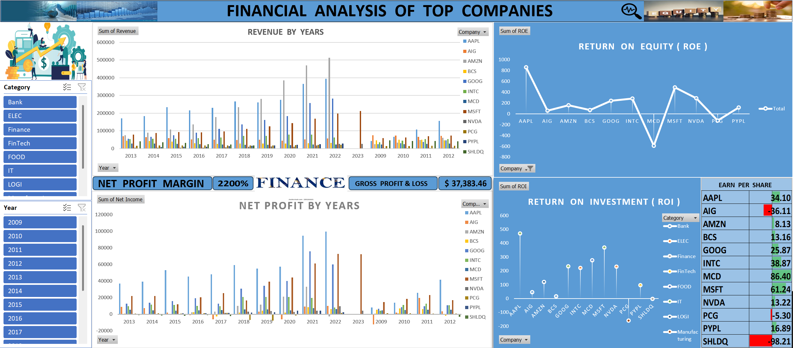

# FINANCE_ANALYSIS

## Overview : 
Best Investment Choices: Apple (AAPL), Microsoft (MSFT), Google (GOOG), and NVIDIA (NVDA) > Strong revenue, high ROE, positive EPS, and high ROI.
Risky Investments: AIG, SHLDQ, and PCG > Negative net income, poor EPS, and low financial returns.
Sectors to Focus On: Technology and IT sectors show the highest profitability, while banking and logistics sectors have moderate returns..

## Tool used : MS EXCEL
&nbsp;

## Revenue and Growth Trends :
- Apple (AAPL) has the highest revenue growth over the years, showing strong market dominance.
- Amazon (AMZN) and Google (GOOG) also demonstrate consistent revenue increases, reinforcing their strong positions in the industry.
- Companies like AIG and SHLDQ struggle with revenue consistency, indicating weaker business performance.

## Net Profit and Profitability :
- Apple (AAPL) and Microsoft (MSFT) are the most profitable, with consistent high net income.
- Amazon (AMZN) had periods of lower net income, showing investment-heavy growth strategies.
- AIG and SHLDQ report negative net profits, indicating financial distress and poor profitability.
- The overall Net Profit Margin is 2200%, suggesting high profitability across selected companies.

#### Financial Performance Indicators :

## Return on Equity (ROE):
- Apple (AAPL) has a remarkably high ROE, showing efficient use of equity.
- Companies like AIG and MCD have negative or fluctuating ROE, indicating weaker financial returns.
- Microsoft (MSFT) also shows strong ROE performance.

## Return on Investment (ROI):
- Technology companies (AAPL, MSFT, GOOG) lead in ROI, making them attractive investment options.
- Financial and banking sectors have lower ROI, reflecting more stable but slower growth.
- SHLDQ and AIG exhibit negative ROI, warning investors of poor capital efficiency.

## Earnings Per Share (EPS) Analysis :
- Microsoft (MSFT) has the highest EPS at 86.40, making it a strong choice for investors.
- Apple (AAPL), Google (GOOG), and Amazon (AMZN) also have positive EPS, showing steady earnings.
- AIG and SHLDQ have negative EPS, which signals financial troubles and possible investor losses.

## Dashboard :
&nbsp;

